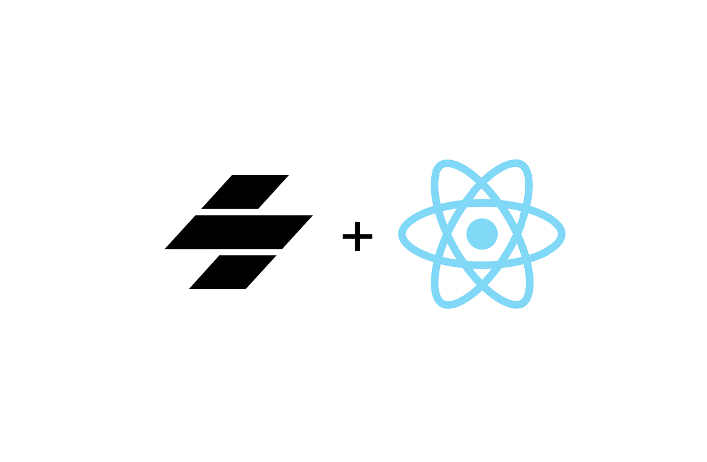

<p align="center">
  
</p>

# stencil-react

[![npm package][npm-image]][npm-url]
[![Build Status][travis-image]][travis-url]
[![Coverage Status][coveralls-image]][coveralls-url]
[![Dependencies Status][david-image]][david-url]

Generate React Components ("bindings") from Stencil 1.x projects.

## Usage

Make sure your Stencil v1 component library (e.g, `@anjuna/core`) is installed as an npm dependency.

```
npm i stencil-react
stencil-react @anjuna/core --outDir dist
```

### Options

| Option              | Description                                   | Default Value |
|---------------------|-----------------------------------------------|---------------|
| `--outDir`          | Output directory                              | `dist`        |
| `--packageJson`     | Override output package.json fields           | N/A           |
| `--packageJsonPath` | Override output package.json fields from file | N/A           |

You cannot override fields `['main', 'module', 'types', 'peerDependencies', 'dependencies']`.

### Output

Your output directory will contain:

- A `package.json` file with `main`, `module`, and `types` fields
- An ES Module build of your React-wrapped Stencil components
- A CommonJS build of your React-wrapped Stencil components
- TypeScript types
- Source Maps

## Usage (In React)

The generated NPM package is the original, suffixed with `-react`.

All your Stencil Components will be exported from the main/module entry file. E.g., if you had a `Button` component:

```jsx
import { Button } from '@anjuna/core-react';
```

Custom properties, custom events, synthentic React events, and aria-attributes are all supported:

```jsx
import React from 'react';
import ReactDOM from 'react-dom';

const App = (
  <Button
    context="primary"
    anjBlur={(customBlurEvent) => { debugger; }}
    onClick={(syntheticReactClickEvent) => { debugger; }}
    aria-label="My ARIA Example"
  >
    Hello World
  </Button>
);

ReactDOM.render(<App />, document.body);
```

[npm-image]:https://img.shields.io/npm/v/stencil-react.svg
[npm-url]:https://www.npmjs.com/package/stencil-react
[travis-image]:https://travis-ci.org/petermikitsh/stencil-react.svg?branch=master
[travis-url]:https://travis-ci.org/petermikitsh/stencil-react
[david-image]:https://david-dm.org/petermikitsh/stencil-react/status.svg
[david-url]:https://david-dm.org/petermikitsh/stencil-react
[coveralls-image]:https://coveralls.io/repos/github/petermikitsh/stencil-react/badge.svg?branch=master
[coveralls-url]:https://coveralls.io/github/petermikitsh/stencil-react?branch=master
